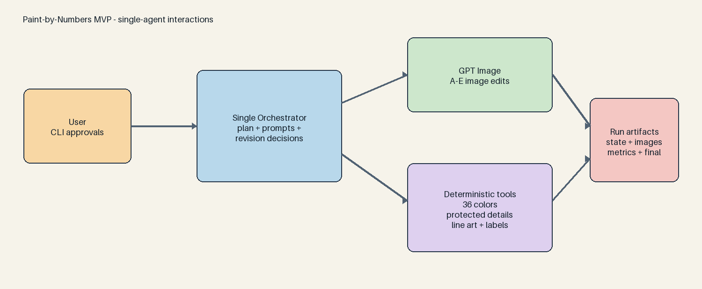

# Paint-by-Numbers Agent MVP

這是一個單一 Orchestrator Agent 的分階段 MVP。它把原圖依序產生 A–E，並在 C、E 暫停等待人工確認，最後以確定性的影像處理產生36色色票、線稿與完成預覽。

## 工作流

1. A：提取三隻貓與毛線球，轉成無筆觸的大型封閉平塗色區，並輸出純洋紅去背版本。
2. B：移除主體，把家具、門和地板轉成大型封閉平塗色區。
3. C：程式對齊 A、移除洋紅背景後逐像素貼到 B；等待人工確認。此步驟不使用 ImageGen 重畫主體。
4. D：在不破壞大型色區的前提下，加入非常節制的簡化油畫感。
5. E：移除殘留細碎筆觸與小色斑；等待人工確認。
6. Final：精確量化成36色，保護眼睛高光，合併一般小區域，輸出線稿、編號和色票。



## 安裝

```bash
uv sync
```

API key 由 `.env.local` 的 `OPENAI_API_KEY` 載入。不要將該檔案提交到版本控制。

## 建立第一個 run

```bash
uv run python main.py init \
  --input sample/cats.png \
  --run-id cats-mvp

uv run python main.py plan \
  --run output/cats-mvp
```

`plan` 會讓 Orchestrator 檢視原圖並產生型別化的 A–E prompt。若只想檢查本機流程，可使用 `--offline` 載入已審核的基準 prompt。

## 分階段生成

每次真正執行 `generate` 都會呼叫 Image API 並產生成本。可以先加上 `--prompt-only` 檢查 prompt、參考圖與輸出位置。

```bash
uv run python main.py generate --run output/cats-mvp --stage A
uv run python main.py generate --run output/cats-mvp --stage B
uv run python main.py generate --run output/cats-mvp --stage C
```

Stage C 使用確定性合成。`attempt-XX.composite.json` 會記錄主體像素一致性；若調整去背演算法，可用 `rebuild-c` 重建同一次 attempt，不消耗修改額度。

檢查 `output/cats-mvp/C.png`。需要修正時：

```bash
uv run python main.py generate \
  --run output/cats-mvp \
  --stage C \
  --feedback "請保持三隻貓位置不變，只修正右側貓咪的眼睛。"
```

確認後：

```bash
uv run python main.py approve --run output/cats-mvp --stage C
uv run python main.py generate --run output/cats-mvp --stage D
uv run python main.py generate --run output/cats-mvp --stage E
uv run python main.py approve --run output/cats-mvp --stage E
uv run python main.py finalize --run output/cats-mvp
```

## 最終輸出

`output/<run-id>/final/` 包含：

- `simplified-E.png`
- `completed-preview.png`
- `blank-line-art.png`
- `numbered-line-art.png`
- `palette.png`
- `palette.json`
- `region-report.json`

若有人工繪製的保護遮罩，可在 `finalize` 加入 `--protected-mask mask.png`。遮罩中的區域不會因一般小區域規則被合併；程式也會自動偵測鄰近深色細節的微小亮點，以保護眼睛高光。

## 驗證

```bash
uv run pytest
uv run python main.py status --run output/cats-mvp
```

完整契約與限制見 [docs/mvp-spec.md](docs/mvp-spec.md)。
